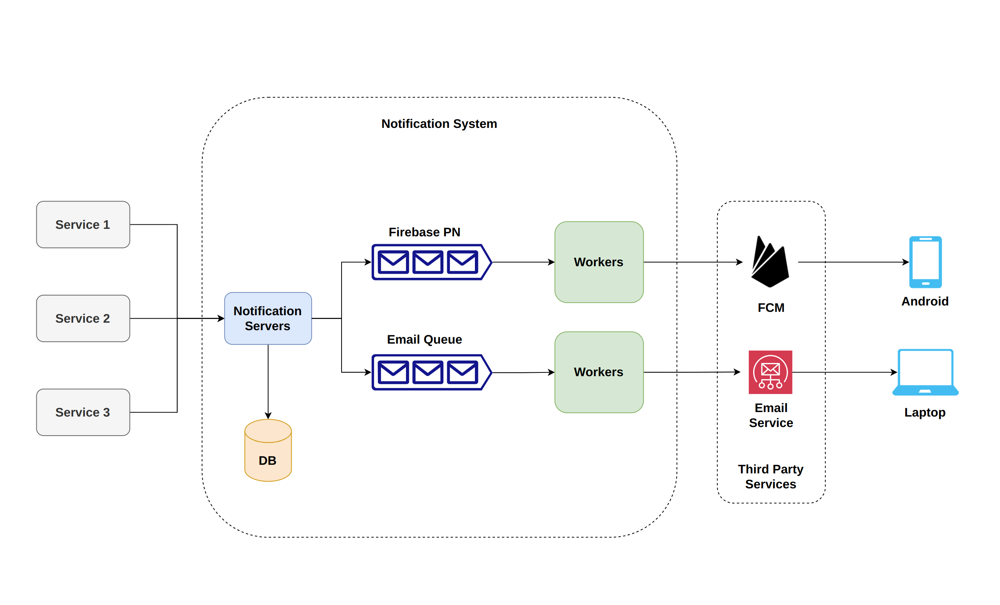

# Notification System
Implements a cloud-native notification system that can be configured to use different sources and targets for the notifications

Sources can be any other application running on the same cluster. Weather Service is implemented as an example

Targets can be email and android push notification, and more to come.

## Tech Stack
- Docker - containerization
- Kuberentes - container orchestration engine
- Helm - deployment of the system
- Golang - backend implementation
- MySQL - database
- Kafka - message queues
- Python - example weather service as a notification source
- Android - simple app for push notification demonstration

## Architecture Design

### Components

#### Services
These are external services which want to send notifications to their users. As an example, Weather Service has been implemented

> NOTE: It is the responsibility of the Services to propagate the users' preferences to notification server via the exposed APIs. Notification server will not expose APIs or interact directly with users in anyway

#### Notification Servers
These are scalable servers that define APIs for the Services to interact with. Mainly, 4 HTTP APIs are exposed to Services: RegisterService(), SetUserPreferences(), SetUserDetails(), SendNotification()

#### Database
All the data related to users, Services, preferences are stored in the database

#### Message Queues
Send-notification requests will be queued for the workers to pick up and send

#### Workers
They are actually responsible for the sending the notifications to the respective end devices via third party services